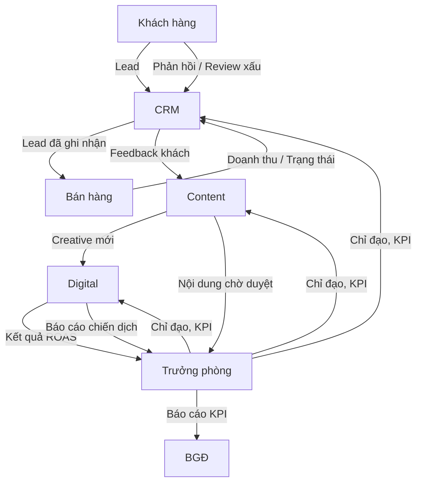

# HƯỚNG DẪN QUẢN LÝ TÀI LIỆU & TƯƠNG TÁC NHÂN SỰ

**Áp dụng cho:** Toàn bộ thành viên phòng Marketing – Laptop Thịnh Vượng  
**Mục tiêu:** Mỗi người biết rõ **mình quản lý tài liệu nào**, **ai là đầu mối phối hợp**, **cách tương tác hàng ngày**.

---

## 1. SƠ ĐỒ LUỒNG CÔNG VIỆC HÀNG NGÀY

---

## 2. PHÂN CÔNG THEO VAI TRÒ

---

### 👤 Trưởng phòng Marketing

**Tài liệu chịu trách nhiệm chính:**
- `organization.md` — cập nhật cơ cấu team, ngân sách, KPI
- `doc.md` — SOP tổng thể, phê duyệt thay đổi
- `improvement.md` — theo dõi lỗ hổng, ưu tiên bổ sung
- `kiểm kê thương hiệu.md` — chủ trì audit, duyệt brand guideline
- Tất cả báo cáo tổng hợp (ROAS, KPI tuần/tháng)

**Tương tác với:**
- **BGĐ** — báo cáo chiến lược, xin ngân sách
- **Quản lý Bán hàng** — phối hợp lead handoff
- **Toàn bộ team** — giao việc, đánh giá

**Quy trình làm việc:**
- Họp daily 15 phút + weekly review 60 phút
- Phê duyệt nội dung/ads trước khi đăng; lưu lịch sử phê duyệt trên Google Drive
- Chủ trì họp khủng hoảng (cấp 2, 3)
- Gửi báo cáo KPI tổng hợp cho BGĐ vào thứ Sáu tuần cuối tháng
- Họp 30 phút/tuần với Bán hàng để review chất lượng lead và tỷ lệ chốt đơn
- Cập nhật `organization.md` mỗi quý; cập nhật `doc.md` khi có SOP mới

---

### ✍️ Chuyên viên Nội dung & Sáng tạo

**Tài liệu chịu trách nhiệm chính:**
- `onboard sản phẩm mới.md` — chụp ảnh, quay video, viết mô tả, tối ưu SEO
- `kiểm tra tuân thủ cam kết.md` — tự kiểm tra nội dung trước khi gửi duyệt
- `sáng tạo ý tưởng & lưu trữ thất bại.md` — gửi ý tưởng mỗi tuần, ghi nhận thất bại từ content
- Template: `Lich_noi_dung_thang.xlsx`, `Template_mo_ta_san_pham.docx`

**Tương tác với:**
- **Trưởng phòng** — gửi duyệt nội dung trước 15h hàng ngày
- **Digital** — cung cấp brief quảng cáo, nhận yêu cầu creative; bàn giao ảnh/video đúng định dạng (MP4, JPG, <10MB)
- **CRM** — hàng tuần hỏi "khách đang thắc mắc điều gì nhất?" để viết blog giải đáp

**Quy trình làm việc:**
- Khi có sản phẩm mới → cập nhật ngay `Onboard_san_pham.xlsx` và chụp ảnh theo checklist
- Khi nhận brief mới → hỏi rõ thông số từ kho trong 2 giờ
- Mỗi thứ Ba trước 14h → gửi ít nhất 1 ý tưởng mới vào `Kho_y_tuong_chung.xlsx`
- Tham gia brainstorm thứ Tư hàng tuần

---

### 📈 Chuyên viên Digital Marketing

**Tài liệu chịu trách nhiệm chính:**
- `chia sẻ dữ liệu & bàn giao.md` — quản lý sheet lead từ QC, gửi lead hot vào nhóm Zalo
- `onboard sản phẩm mới.md` — set up quảng cáo cho sản phẩm P0/P1, tạo từ khóa
- `kiểm tra tuân thủ cam kết.md` — kiểm tra copy quảng cáo trước khi chạy
- `quản lý review xấu.md` — dừng ads khi có khủng hoảng, giám sát từ khóa tiêu cực
- Template: `Bao_cao_ROAS_ngay.xlsx`, `Tu_khoa_ads.xlsx`

**Tương tác với:**
- **Trưởng phòng** — báo cáo ROAS, xin ngân sách
- **Content** — nhận creative mới, yêu cầu chỉnh sửa (ví dụ: "cần 3 ảnh + 1 video 15s cho chiến dịch Thinkpad")
- **Bán hàng** — gửi lead hot, xác nhận doanh thu từ ads

**Quy trình làm việc:**
- Cập nhật `Bao_cao_ROAS_ngay.xlsx` trước 9h mỗi sáng
- Ghi lead (FB Lead Gen, Google Call Only) vào `Lead_tu_Marketing_template.xlsx` trong 15 phút; nếu lead **Hot** → gửi ngay vào nhóm Zalo `#lead-hot` kèm SĐT
- Nếu ROAS <2.5 trong 3 ngày liên tiếp → báo động đỏ, dừng chiến dịch, họp khẩn với Trưởng phòng
- Phối hợp với Content để test A/B creative mỗi tuần
- Chiến dịch ngân sách >10tr → gửi cập nhật mỗi 6h cho Trưởng phòng

---

### 💬 Chuyên viên CRM & Chăm sóc KH

**Tài liệu chịu trách nhiệm chính:**
- `chia sẻ dữ liệu & bàn giao.md` — ghi nhận lead từ hotline, inbox, livestream; cập nhật trạng thái xử lý
- `quản lý review xấu.md` — phát hiện, phân loại, phản hồi công khai, liên hệ riêng với khách
- `kiểm tra tuân thủ cam kết.md` — kiểm tra email/sms trước khi gửi
- `sáng tạo ý tưởng & lưu trữ thất bại.md` — đề xuất chương trình KH thân thiết, ghi nhận thất bại từ email
- Template: `Theo_doi_review_xau.xlsx`, `Lead_tu_Marketing_template.xlsx`

**Tương tác với:**
- **Trưởng phòng** — báo cáo NPS, tỷ lệ chốt đơn từ lead
- **Bán hàng** — gửi lead đã xử lý (có ghi chú nhu cầu), nhận cập nhật trạng thái; yêu cầu bán hàng ghi mã lead khi chốt đơn
- **Content** — cung cấp phản hồi khách để viết bài hữu ích

**Quy trình làm việc:**
- Quét review xấu mỗi sáng và chiều; ghi vào `Theo_doi_review_xau.xlsx`
- Phản hồi công khai trong 30 phút với review cấp độ 1
- Kiểm tra sheet lead mỗi 2 giờ; xử lý lead **Hot** trong 15 phút; cập nhật cột "Trạng thái xử lý" ngay sau khi gọi
- Nếu review leo thang cấp 2 → báo ngay Trưởng phòng
- Thứ Sáu hàng tuần → gửi báo cáo "Tỷ lệ chốt đơn từ lead marketing" cho Trưởng phòng

---

## 3. HỆ THỐNG THƯ MỤC & QUYỀN TRUY CẬP

| Thư mục (Google Drive) | Trưởng phòng | Content | Digital | CRM |
|------------------------|:-----------:|:-------:|:-------:|:---:|
| `01_Chiến lược/` (organization, doc, improvement) | Full | Đọc | Đọc | Đọc |
| `02_Nội dung/` (ảnh, video, blog, lịch nội dung) | Duyệt | Full | Đọc | Đọc |
| `03_Quảng cáo/` (báo cáo ROAS, từ khóa, lịch chạy) | Xem | Đọc | Full | – |
| `04_CRM/` (lead, review xấu, email mẫu) | Xem | – | – | Full |
| `05_Báo cáo/` (brand audit, thất bại, KPI tuần) | Full | Thêm mới | Thêm mới | Thêm mới |

**Giải thích quyền truy cập:**
- `Full` — tạo, sửa, xóa, chia sẻ
- `Duyệt` — phê duyệt qua comment, không sửa trực tiếp nội dung gốc
- `Đọc` — chỉ xem, không chỉnh sửa
- `Thêm mới` — tạo file mới nhưng không xóa file của người khác

---

## 4. CHECKLIST HÀNG NGÀY

| Thành viên | Buổi sáng (trước 9h30) | Buổi chiều (trước 16h) |
|------------|------------------------|------------------------|
| **Trưởng phòng** | Daily stand-up, kiểm tra báo cáo ROAS, duyệt nội dung tồn | Họp với BGĐ/Bán hàng nếu cần, phê duyệt ngân sách mới |
| **Content** | Kiểm tra lịch nội dung, viết nháp bài mới, xử lý ảnh | Gửi bài duyệt, lên lịch đăng bài cho ngày mai |
| **Digital** | Cập nhật ROAS, điều chỉnh bid, thêm từ khóa âm | Set up campaign mới, phối hợp Content làm creative |
| **CRM** | Quét review xấu, gọi lead Hot, cập nhật sheet lead | Gửi email/sms chiến dịch, tổng hợp lead trong ngày |

---

## 5. LƯU Ý QUAN TRỌNG

- **Không làm việc trong silo:** Mọi tài liệu quan trọng (lead, nội dung, báo cáo) phải lưu trên Google Drive dùng chung — không lưu trên máy cá nhân.
- **Xử lý conflict:** Nếu Content và Digital không thống nhất về creative, Trưởng phòng là người quyết định cuối cùng.

---

*Tài liệu này sẽ được cập nhật khi có thay đổi về cơ cấu team hoặc quy trình. Mọi góp ý xin gửi về Trưởng phòng Marketing.*
