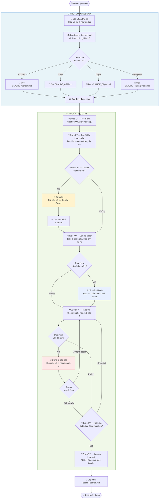
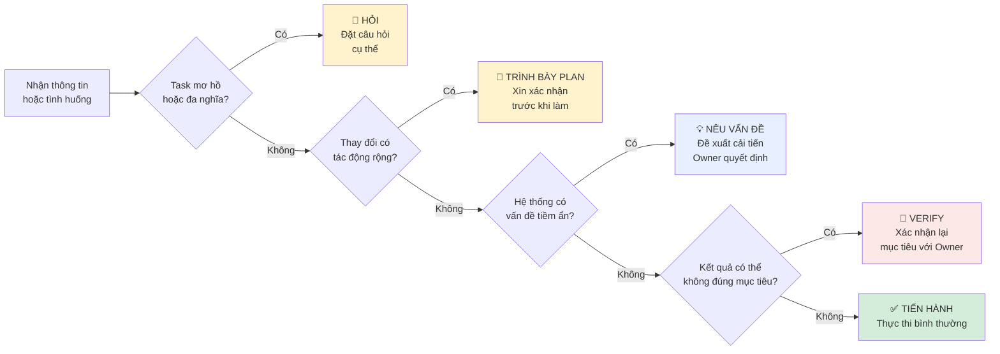
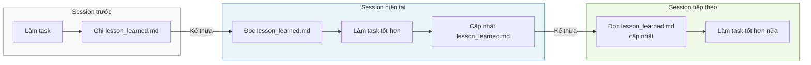

# AI Workflow — Cách Claude Làm Việc

> Mở file này trong VSCode với extension **Markdown Preview** (hoặc `Cmd+Shift+V`) để xem sơ đồ.

---

## Sơ đồ tổng thể

---

## Sơ đồ quyết định — Khi nào Claude dừng lại?

---

## Vòng lặp kế thừa kiến thức

---

## Vai trò — Senior Co-worker vs Công cụ thụ động

| | Công cụ thụ động | Claude (Senior Co-worker) |
|--|:--:|:--:|
| Nhận task không rõ | Tự đoán, làm sai | 🛑 Dừng hỏi trước |
| Phát hiện vấn đề hệ thống | Bỏ qua | 💡 Nêu ra + đề xuất |
| Làm xong task | Dừng | ✅ Ghi lesson learned |
| Session mới | Bắt đầu từ đầu | 📚 Đọc lại kinh nghiệm cũ |
| Phạm vi task | Làm đúng yêu cầu | Làm đúng + đề xuất cải tiến |

---

## Tài liệu liên quan

- [CLAUDE.md](CLAUDE.md) — Nguyên tắc & 7 bước chi tiết
- [../lesson_learned.md](../lesson_learned.md) — Kinh nghiệm tích lũy
- [../sơ_đồ.md](../sơ_đồ.md) — Cấu trúc toàn bộ dự án
